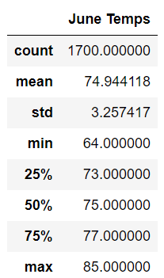
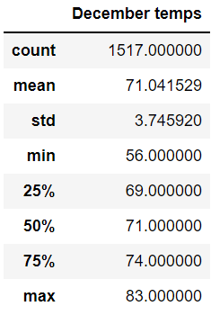
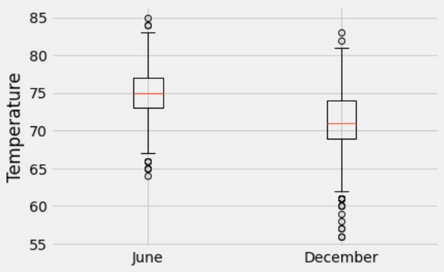
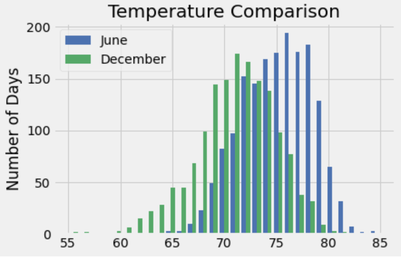

# Overview of the Oahu Surfs Up Analysis

### A potential surf and ice cream shop owner in Oahu wants information about the weather in June and December to make decisions about opening a shop. The analyses include data from an sqlite database read in using SQLAlchemy. Python in combination with Pandas will retrieve the weather information for June and December. Additional queries are performed to gather even more information for and informed decision.

<br/>

## Deliverable 1: Determine the Summary Statistics for **June** 

<br/>

 

<br/>

#### Here is the Python code to generate the June temp statistics
```Python
date_str = "06"
temps = session.query(Measurement.tobs).\
    filter(func.strftime("%m", Measurement.date) == date_str).all()
	
junetemps = list(np.ravel(temps))

junetemps_df = pd.DataFrame(junetemps, columns=['June Temps'])
	
junetemps_df.describe()
```

<br/>

## Deliverable 2: Determine the Summary Statistics for **December** 

<br/>

 

<br/>

#### Here is the Python code to generate the December temp statistics
```Python
date_str1 = "12"
temps1 = session.query(Measurement.tobs).\
    filter(func.strftime("%m", Measurement.date) == date_str1).all()
	
dectemps = list(np.ravel(temps1))

dectemps_df = pd.DataFrame(dectemps, columns=['December Temps'])
	
dectemps_df.describe()
```

<br/>

## Deliverable 3: Results and Summary

<br/>

### Results
- Mean temperature is not much higher in June vs December (indicating a very moderate climate) 
    - June = 74.9 and December = 71.0

- Minimum temperature in December is only 8 degrees lower than the minimum temp in June
    - June = 64 and December = 56

- Maximum temperature in June is only 2 degrees higher than the maximum temp in December
    - June = 85 and December = 83

- The Interquartile Range (IQR) for June overlaps the IQR for December, as seen in the graph below

      


<br/>

### Summary

<br/>

#### From the inital temperature analysis of June and December, it is clear that Oahu has a very mild climate year round. The differences in average temp and minimum temp is very small. The maximum temp between June and December only differ by 2 degrees. It looks like a surf and ice cream shop could operate for the entire year.

    


#### Another aspect the potential shop owner my want to see is the differences in precipitation for these 2 months of the year. 